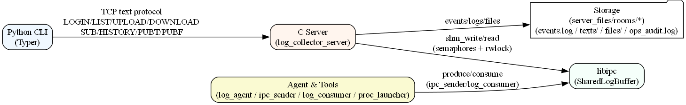

### High-level Architecture

本文档以高层视角解析 ming-drlms 的系统架构。

- 核心组件（Core Components）
  - C Server: `log_collector_server`（多线程 TCP 服务器，协议与房间化空间）
  - C Library: `libipc`（共享内存环形缓冲，semaphores + rwlock）
  - Python CLI: `ming-drlms`（Typer 组织的命令组与教学式帮助）
  - Agent & Tools: `log_agent`、`ipc_sender`、`log_consumer`、`proc_launcher`
  - Storage: `server_files/`（rooms/ 事件持久化、审计与文件落盘）

下图展示组件之间的交互关系。

---

### Design Philosophy

选择 C + Python 的混合架构，旨在平衡以下目标：

- 性能与可控性：C 负责高并发 TCP、文件 I/O、安全与节流；libipc 提供零拷贝式消息分发。
- 体验与可维护性：Python CLI 提供友好的交互、打包发布与教学式帮助。
- 易演示与安全默认：文本协议可读、Argon2id 认证、遗留口令透明升级、可配置限速与并发上限。

---

### Component Overview

- C Server（`src/server/`）
  - 每连接一线程模型（thread-per-connection），超时与 keepalive，活动连接上限。
  - **M-Proto-v2 协议**：二进制分帧 + Protobuf 消息（认证100-199、房间200-299、联邦300-399）
  - **混合认证**：Challenge-Response + JWT AccessToken + Opaque RefreshToken
  - 房间（Room）与策略（retain/delegate/teardown）、事件持久化与历史回放。
- libipc（`src/libipc/`）
  - System V SHM + `sem_full/sem_empty` + `pthread_rwlock` 的环形缓冲。
  - 分片头 MsgHdr + LAST 标记；背压与并发写读的时序保障。
- Python CLI（`src/ming_drlms/`）
  - Typer 组织 server/client/space/room/user/dev 命令组。
  - `help show <topic>` 打包 Markdown + Rich 渲染；`~/.drlms/state.json` 保存 since_id 等状态。
- Agent & Tools（`src/agent/`, `src/tools/`）
  - 采集上传、IPC 发送/消费、进程拉起。
- Storage（`server_files/`）
  - `rooms/<room>/{events.log,texts/,files/}` 与 `ops_audit.log`。

---

### Core Flows

- **M-Proto-v2 Authentication**（Challenge-Response + JWT + RefreshToken）
- **Room Subscribe & History Replay**（MSG_TYPE_ROOM_SUB_REQUEST → SQLite 查询 + RoomEvent Protobuf 回放）
- **Publish Text/File**（MSG_TYPE_ROOM_PUB_REQUEST → rooms_store_text → RoomEvent 扇出）
- **Event Fanout**（RoomEvent Protobuf + MP2 分帧 → 所有订阅者）
- LOG → IPC（shm_write，tools/consumer 可 tail）

---

### Security & Performance Notes

- Argon2 参数可经环境变量覆盖；users.txt 原子写入；错误码与权限检查清晰。
- 上传/下载与扇出均可按字节节流；连接上限与超时防御资源耗尽。

